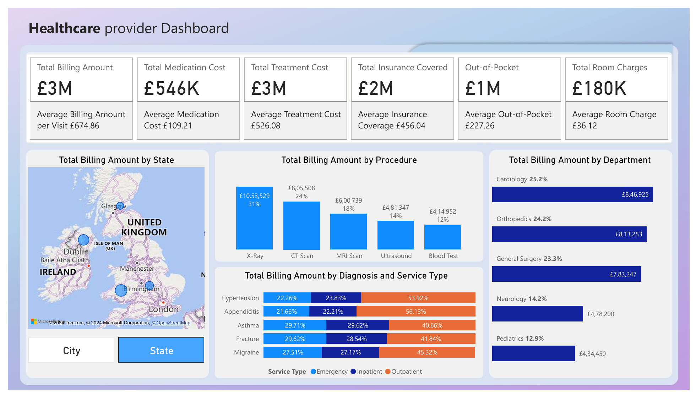

# Healthcare Provider Dashboard

**Overview**
This project provides a comprehensive dashboard for visualizing hospital visit data. The dashboard is designed to help healthcare providers, administrators, and researchers gain insights into various aspects of patient visits, including costs, satisfaction scores, insurance coverage, and follow-up requirements. By utilizing this dashboard, users can make informed decisions to enhance patient care and operational efficiency.

**Requirements:**

**1. KPIs and Trends:** Identify and present the key performance indicators (KPIs) and significant trends in the 
dataset. 
**2. Detailed Analysis:** Ensure the analysis is thorough and 
detailed, covering all relevant aspects of the healthcare 
center's finance and the performance of healthcare 
providers. 
**3. Dashboard Creation:** Create a comprehensive 
dashboard consisting of 3 to 4 pages that includes: - Financial Overview: Summarize the financial health of 
the healthcare center. 
- Provider Insights: Analyze the performance and 
efficiency of healthcare providers. 
- Trend Analysis: Highlight any important trends over 
time. 
- Additional Insights: Any other relevant insights that can 
be derived from the data. 
